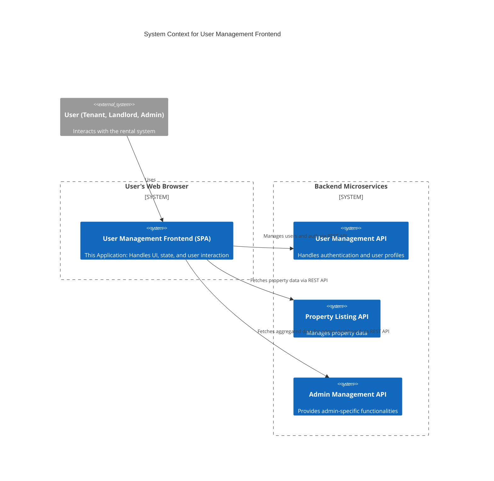

# Rental User Management Frontend

[](https://opensource.org/licenses/MIT)
[](https://www.typescriptlang.org/)
[](https://reactjs.org/)
[](https://vitejs.dev/)
[](https://tailwindcss.com/)

The User Management Frontend is the primary user-facing application for the Rent Management System. It provides a modern, responsive, and feature-rich interface for tenants, landlords, and administrators to interact with the platform.

## Table of Contents
- [Introduction](#introduction)
- [Features](#features)
- [Architecture](#architecture)
- [Design Patterns & Key Concepts](#design-patterns--key-concepts)
- [Technologies Used](#technologies-used)
- [Folder Structure](#folder-structure)
- [Setup Guide](#setup-guide)
  - [Prerequisites](#prerequisites)
  - [Environment Variables](#environment-variables)
  - [Installation](#installation)
  - [Running the Application](#running-the-application)
- [Key Components](#key-components)
- [State Management](#state-management)
- [Styling](#styling)
- [Testing](#testing)
- [Contributing](#contributing)
- [License](#license)
- [Contact](#contact)

## Introduction
This application serves as the main entry point for all users of the Rent Management System. It is a Single Page Application (SPA) built with React and TypeScript, designed to be fast, secure, and scalable. It handles all aspects of user interaction, from initial registration and login to profile management and accessing role-specific dashboards. It communicates with a suite of backend microservices to fetch and manipulate data, providing a seamless experience for the end-user.

## Features
-   **Robust Authentication**: Secure user login, registration, password reset, and session management.
-   **Role-Based Access Control (RBAC)**: Custom-tailored dashboards and protected routes for different user roles (Tenant, Landlord, Admin).
-   **Profile Management**: Users can view and edit their profile information.
-   **Multi-Language Support**: Internationalization (i18n) support for English, Amharic, and Oromo.
-   **Responsive Design**: A mobile-first, responsive UI built with Tailwind CSS that works on any device.
-   **Theming**: Light and dark mode support.
-   **Error Handling**: Graceful error handling with a global error boundary and user-friendly toast notifications.

## Architecture
This application is a **Single Page Application (SPA)** that acts as the primary client for the backend microservice ecosystem. It is responsible for all rendering and user interaction, communicating with various APIs to provide a dynamic experience.



## Design Patterns & Key Concepts

-   **Component-Based Architecture**: The UI is built as a collection of reusable, self-contained React components.
-   **Custom Hooks**: Logic is encapsulated and reused across components using custom hooks like `useAuth` and `useProfile`.
-   **Global State Management**: **Zustand** is used for lightweight, centralized state management, handling authentication tokens, and user profile data.
-   **Protected Routes**: The `ProtectedRoute` component leverages the global auth state to guard routes and ensure only authenticated and authorized users can access specific pages.
-   **API Client Abstraction**: All API interactions are centralized in `lib/api-client.ts`. This provides a single place to configure headers (like `Authorization`), handle request/response logic, and manage errors.
-   **Lazy Loading**: React.lazy and Suspense can be used to code-split the application, improving initial load times by only loading the components needed for the current view.

## Technologies Used
-   **Framework**: [React](https://reactjs.org/), [Vite](https://vitejs.dev/)
-   **Language**: [TypeScript](https://www.typescriptlang.org/)
-   **Styling**: [Tailwind CSS](https://tailwindcss.com/)
-   **Routing**: [React Router](https://reactrouter.com/)
-   **State Management**: [Zustand](https://github.com/pmndrs/zustand)
-   **Internationalization**: [i18next](https://www.i18next.com/)
-   **Testing**: [Vitest](https://vitest.dev/), [React Testing Library](https://testing-library.com/docs/react-testing-library/intro/)
-   **Linting/Formatting**: ESLint, Prettier

## Folder Structure
The `src` directory is organized to separate concerns and promote scalability.
```
src/
├── __tests__/         # Test files (unit and integration)
├── asset/             # Static assets like images and icons
├── components/        # Reusable React components, organized by feature
│   ├── auth/          # Authentication-related components
│   ├── common/        # Components used across the entire app (Spinner, Toast)
│   ├── dashboard/     # Role-specific dashboard components
│   └── ...
├── hooks/             # Custom React hooks for shared logic
├── lib/               # Core logic, helpers, and API clients (Zustand stores, i18n config)
├── locales/           # Translation files for i18n
├── pages/             # Top-level page components that correspond to routes
├── providers/         # React context providers (e.g., AuthProvider)
└── types/             # Global TypeScript type definitions
```

## Setup Guide

### Prerequisites
-   Node.js (v18.x or higher)
-   `npm` or `yarn`

### Environment Variables
Create a `.env.local` file in the root directory by copying `.env.example` (if it exists) or creating a new one.

```
# .env.local

# The base URL for the backend API gateway or primary microservice
VITE_API_BASE_URL="http://localhost:8000/api/v1"

# URL for the landlord-specific micro-frontend, used for redirection after login
VITE_LANDLORD_MICROFRONTEND_URL="https://rent-management-landlord-frontend.vercel.app"
```

### Installation
1.  **Clone the repository**:
    ```bash
    git clone https://github.com/rent-management-system/rental-user-management-frontend.git
    cd rental-user-management-frontend
    ```

2.  **Install dependencies**:
    ```bash
    npm install
    ```

### Running the Application
1.  **Start the development server**:
    ```bash
    npm run dev
    ```
    The application will be available at `http://localhost:5173`.

2.  **Run the mock API server (optional)**:
    If you need a mock backend for development, you can use the included `json-server`.
    ```bash
    npm run mock:server
    ```
    The mock API will be available at `http://localhost:3001`.

3.  **Build for production**:
    ```bash
    npm run build
    ```
    The production-ready files will be in the `dist/` directory.

## Key Components
-   **`AuthLayout.tsx`**: A layout component that provides the common UI shell for all authentication-related pages (Login, Signup).
-   **`ProtectedRoute.tsx`**: A higher-order component that wraps around routes, checking for a valid authentication token and user role before allowing access.
-   **`AdminDashboard.tsx` / `LandlordDashboard.tsx` / `TenantDashboard.tsx`**: Role-specific components that serve as the main entry point for users after they log in.
-   **`ProfileEditor.tsx`**: A form component that allows users to update their personal information.
-   **`LoadingSpinner.tsx`**: A reusable spinner component displayed during data fetching or page transitions.

## State Management
Global application state is managed with **Zustand**. This includes:
-   **`auth-store.ts`**: Manages the user's authentication token, authentication status, and user role.
-   **`profile-store.ts`**: Caches the logged-in user's profile data to avoid redundant API calls.

Zustand was chosen for its simplicity, minimal boilerplate, and performance.

## Styling
The project uses **Tailwind CSS** for a utility-first styling approach. This allows for rapid development and easy maintenance of a consistent design system. Global styles and base Tailwind configurations are located in `src/index.css`.

## Testing
Testing is done using **Vitest** and **React Testing Library**.
-   **Unit Tests**: Focus on individual components and hooks in isolation.
-   **Integration Tests**: Test the interaction between multiple components, such as form submissions and routing.

To run all tests, use the following command:
```bash
npm run test
```

## Contributing
Contributions are what make the open-source community such an amazing place to learn, inspire, and create. Any contributions you make are **greatly appreciated**.

This project is developed and maintained by:
-   [Dagmawi Teferi](https://github.com/dagiteferi)
-   [Abeni Tilahun](https://github.com/Abeni5)
-   [Nehmya Biruk](https://github.com/Nehmyabiruk)

To contribute:
1.  Fork the Project
2.  Create your Feature Branch (`git checkout -b feature/AmazingFeature`)
3.  Commit your Changes (`git commit -m 'Add some AmazingFeature'`)
4.  Push to the Branch (`git push origin feature/AmazingFeature`)
5.  Open a Pull Request

## License
This project is licensed under the MIT License. See the `LICENSE` file for more information.

## Contact
Dagmawi Teferi - [dagiteferi2011@gmail.com](mailto:dagiteferi2011@gmail.com)

Project Link: [https://github.com/rent-management-system/rental-user-management-frontend](https://github.com/rent-management-system/rental-user-management-frontend)